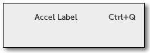

## display Widgets
### Label
 — _A widget that displays a small to medium amount of text_ [Label](https://gtk-rs.org/docs/gtk/struct.Label.html)

Labels are the main method of placing non-editable text in windows, for instance to place a title next to a Gtk.Entry widget. You can specify the text in the constructor, or later with the Gtk.Label.set_text() or Gtk.Label.set_markup() methods.

The width of the label will be adjusted automatically. You can produce multi-line labels by putting line breaks (“\n”) in the label string.

Labels can be made selectable with Gtk.Label.set_selectable(). Selectable labels allow the user to copy the label contents to the clipboard. Only labels that contain useful-to-copy information — such as error messages — should be made selectable.

The label text can be justified using the Gtk.Label.set_justify() method. The widget is also capable of word-wrapping, which can be activated with Gtk.Label.set_line_wrap().

Gtk.Label support some simple formatting, for instance allowing you to make some text bold, colored, or larger. You can do this by providing a string to Gtk.Label.set_markup(), using the Pango Markup syntax 1. For instance, <b>bold text</b> and <s>strikethrough text</s>. In addition, Gtk.Label supports clickable hyperlinks. The markup for links is borrowed from HTML, using the a with href and title attributes. GTK+ renders links similar to the way they appear in web browsers, with colored, underlined text. The title attribute is displayed as a tooltip on the link.

```
label.set_markup("Go to <a href=\"https://www.gtk.org\" "
                 "title=\"Our website\">GTK+ website</a> for more")
```

Labels may contain mnemonics. Mnemonics are underlined characters in the label, used for keyboard navigation. Mnemonics are created by providing a string with an underscore before the mnemonic character, such as `_File`, to the functions Gtk.Label.new_with_mnemonic() or Gtk.Label.set_text_with_mnemonic(). Mnemonics automatically activate any activatable widget the label is inside, such as a Gtk.Button; if the label is not inside the mnemonic’s target widget, you have to tell the label about the target using Gtk.Label.set_mnemonic_widget().

### Image
 — _A widget displaying an image_ [Image](https://gtk-rs.org/docs/gtk/struct.Image.html)

### ProgressBar
 — _A widget which indicates progress visually_  [ProgressBar](https://gtk-rs.org/docs/gtk/struct.ProgressBar.html)

The Gtk.ProgressBar is typically used to display the progress of a long running operation. It provides a visual clue that processing is underway. The Gtk.ProgressBar can be used in two different modes: percentage mode and activity mode.

When an application can determine how much work needs to take place (e.g. read a fixed number of bytes from a file) and can monitor its progress, it can use the Gtk.ProgressBar in percentage mode and the user sees a growing bar indicating the percentage of the work that has been completed. In this mode, the application is required to call Gtk.ProgressBar.set_fraction() periodically to update the progress bar, passing a float between 0 and 1 to provide the new percentage value.

When an application has no accurate way of knowing the amount of work to do, it can use activity mode, which shows activity by a block moving back and forth within the progress area. In this mode, the application is required to call Gtk.ProgressBar.pulse() periodically to update the progress bar. You can also choose the step size, with the Gtk.ProgressBar.set_pulse_step() method.

By default, Gtk.ProgressBar is horizontal and left-to-right, but you can change it to a vertical progress bar by using the Gtk.ProgressBar.set_orientation() method. Changing the direction the progress bar grows can be done using Gtk.ProgressBar.set_inverted(). Gtk.ProgressBar can also contain text which can be set by calling Gtk.ProgressBar.set_text() and Gtk.ProgressBar.set_show_text().

[example: progress_tracker](progress_tracker.rs)


### Spinner
 — _Show a spinner animation_ [Spinner](https://gtk-rs.org/docs/gtk/struct.Spinner.html) 

The Gtk.Spinner displays an icon-size spinning animation. It is often used as an alternative to a GtkProgressBar for displaying indefinite activity, instead of actual progress.

To start the animation, use Gtk.Spinner.start(), to stop it use Gtk.Spinner.stop().
12.1. Example

examples: [cairo_png](cairo_png.rs), [cairo_threads](cairo_threads.rs), [cairo_test](cairo_test.rs) [demo](pango_attributes.rs),

### Common display widgets
widgets | description
 ---|---
 | [Label](https://gtk-rs.org/docs/gtk/struct.Label.html) — A widget that displays a small to medium amount of text
 | [Image](https://gtk-rs.org/docs/gtk/struct.Image.html) — A widget displaying an image
| [Spinner](https://gtk-rs.org/docs/gtk/struct.Spinner.html) — Show a spinner animation
| [ProgressBar](https://gtk-rs.org/docs/gtk/struct.ProgressBar.html) — A widget which indicates progress visually
| [InfoBar](https://gtk-rs.org/docs/gtk/struct.InfoBar.html) — Report important messages to the user
| [LevelBar](https://gtk-rs.org/docs/gtk/struct.LevelBar.html) — A bar that can used as a level indicator
| [Statusbar](https://gtk-rs.org/docs/gtk/struct.Statusbar.html) — Report messages of minor importance to the user
| [AccelLabel](https://gtk-rs.org/docs/gtk/struct.AccelLabel.html) — A label which displays an accelerator key on the right of the text
