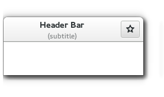

## Layout Containers
[grid.rs](grid.rs) [listbox](listbox.rs) [notebook](notebook.rs)

While many GUI toolkits require you to precisely place widgets in a window, using absolute positioning, GTK+ uses a different approach. Rather than specifying the position and size of each widget in the window, you can arrange your widgets in rows, columns, and/or tables. The size of your window can be determined automatically, based on the sizes of the widgets it contains. And the sizes of the widgets are, in turn, determined by the amount of text they contain, or the minimum and maximum sizes that you specify, and/or how you have requested that the available space should be shared between sets of widgets. You can perfect your layout by specifying padding distance and centering values for each of your widgets. GTK+ then uses all this information to resize and reposition everything sensibly and smoothly when the user manipulates the window.

GTK+ arranges widgets hierarchically, using containers. They are invisible to the end user and are inserted into a window, or placed within each other to layout components. There are two flavours of containers: single-child containers, which are all descendants of gtk::Bin, and multiple-child containers, which are descendants of gtk::Container. The most commonly used are vertical or horizontal boxes (gtk::Box) and grids (gtk::Grid).

### Boxes
— _A container for packing widgets in a single row or column_

[gtk::Box](https://gtk-rs.org/docs/gtk/struct.Box.html) are invisible containers into which we can pack our widgets. When packing widgets into a horizontal box, the objects are inserted horizontally from left to right or right to left depending on whether `gtk::Box.pack_start()` or `gtk::Box.pack_end()` is used. In a vertical box, widgets are packed from top to bottom or vice versa. You may use any combination of boxes inside or beside other boxes to create the desired effect.

#### Example
Let’s take a look at a slightly modified version of the extended example with two buttons.
First, we create a horizontally orientated box container where 6 pixels are placed between children. This box becomes the child of the top-level window.
Subsequently, we add two different buttons to the box container.
While with `gtk::Box.pack_start()` widgets are positioned from left to right, `gtk::Box.pack_end()` positions them from right to left.

### Grid
 — Pack widgets in rows and columns  

[gtk::Grid ](https://gtk-rs.org/docs/gtk/struct.Grid.html) is a container which arranges its child widgets in rows and columns, but you do not need to specify the dimensions in the constructor. Children are added using `gtk::Grid.attach()`. They can span multiple rows or columns. The `gtk::Grid.attach()` method takes five parameters:
-    The child parameter is the gtk::Widget to add.
-    left is the column number to attach the left side of child to.
-    top indicates the row number to attach the top side of child to.
-    width and height indicate the number of columns that the child will span, and the number of rows that the child will span, respectively.

It is also possible to add a child next to an existing child, using `gtk::Grid.attach_next_to()`, which also takes five parameters:
-    child is the gtk::Widget to add, as above.
-    sibling is an existing child widget of self (a gtk::Grid instance) or None. The child widget will be placed next to sibling, or if sibling is None, at the beginning or end of the grid.
-    side is a gtk::PositionType indicating the side of sibling that child is positioned next to.
-    width and height indicate the number of columns and rows the child widget will span, respectively.
Finally, gtk::Grid can be used like a gtk::Box by just using `gtk::Grid.add()`, which will place children next to each other in the direction determined by the “orientation” property (defaults to `gtk::Orientation.HORIZONTAL`).

##### Example: grid

``` rust
extern crate gio;
extern crate gtk;

use gio::prelude::*;
use gtk::prelude::*;

use gtk::{ApplicationWindow, Builder, Button, MessageDialog};

use std::env::args;

fn build_ui(application: &gtk::Application) {
    let glade_src = include_str!("builder_basics.glade");
    let builder = Builder::new_from_string(glade_src);

    let window: ApplicationWindow = builder.get_object("window1").expect("Couldn't get window1");
    window.set_application(Some(application));
    let bigbutton: Button = builder.get_object("button1").expect("Couldn't get button1");
    let dialog: MessageDialog = builder
        .get_object("messagedialog1")
        .expect("Couldn't get messagedialog1");

    bigbutton.connect_clicked(move |_| {
        dialog.run();
        dialog.hide();
    });

    window.show_all();
}

fn main() {
    let application = gtk::Application::new(
        Some("com.github.gtk-rs.examples.builder_basics"),
        Default::default(),
    )
    .expect("Initialization failed...");

    application.connect_activate(|app| {
        build_ui(app);
    });

    application.run(&args().collect::<Vec<_>>());
}
```

### ListBox
 — _A list container_

A [gtk::ListBox](https://gtk-rs.org/docs/gtk/struct.ListBox.html) is a vertical container that contains gtk::ListBoxRow children. These rows can be dynamically sorted and filtered, and headers can be added dynamically depending on the row content. It also allows keyboard and mouse navigation and selection like a typical list.

Using gtk::ListBox is often an alternative to gtk::TreeView, especially when the list content has a more complicated layout than what is allowed by a gtk::CellRenderer, or when the content is interactive (i.e. has a button in it).

Although a gtk::ListBox must have only gtk::ListBoxRow children, you can add any kind of widget to it via `gtk::Container.add()` and a gtk::ListBoxRow widget will automatically be inserted between the list and the widget.
6.3.1. Example
_images/listbox_example.png_

### Stack and StackSwitcher


[Stack](https://gtk-rs.org/docs/gtk/struct.Stack.html) — _A stacking container_
[StackSwitcher](https://gtk-rs.org/docs/gtk/struct.StackSwitcher.html) — _A controller for gtk::Stack_

A [gtk::Stack](https://gtk-rs.org/docs/gtk/struct.Stack.html) is a container which only shows one of its children at a time. In contrast to gtk::Notebook, gtk::Stack does not provide a means for users to change the visible child. Instead, the gtk::StackSwitcher widget can be used with gtk::Stack to provide this functionality.

Transitions between pages can be animated as slides or fades. This can be controlled with `gtk::Stack.set_transition_type()`. These animations respect the “gtk-enable-animations” setting.

Transition speed can be adjusted with `gtk::Stack.set_transition_duration()`

The gtk::StackSwitcher widget acts as a controller for a gtk::Stack; it shows a row of buttons to switch between the various pages of the associated stack widget.

All the content for the buttons comes from the child properties of the gtk::Stack.

It is possible to associate multiple gtk::StackSwitcher widgets with the same gtk::Stack widget.
6.4.1. Example
_images/stack_example.png_

### HeaderBar
  — _A box with a centered child_

A [gtk::HeaderBar](https://gtk-rs.org/docs/gtk/struct.HeaderBar.html) is similar to a horizontal gtk::Box, it allows to place children at the start or the end. In addition, it allows a title to be displayed. The title will be centered with respect to the width of the box, even if the children at either side take up different amounts of space.

Since GTK+ now supports Client Side Decoration, a gtk::HeaderBar can be used in place of the title bar (which is rendered by the Window Manager).

A [gtk::HeaderBar](https://gtk-rs.org/docs/gtk/struct.HeaderBar.html) is usually located across the top of a window and should contain commonly used controls which affect the content below. They also provide access to window controls, including the close window button and window menu.
6.5.1. Example
_images/headerbar_example.png_

### FlowBox
— _A container that allows reflowing its children_
`Note:This example requires at least GTK+ 3.12.`

A [gtk::FlowBox](https://gtk-rs.org/docs/gtk/struct.FlowBox.html) is a container that positions child widgets in sequence according to its orientation.

For instance, with the horizontal orientation, the widgets will be arranged from left to right, starting a new row under the previous row when necessary. Reducing the width in this case will require more rows, so a larger height will be requested.

Likewise, with the vertical orientation, the widgets will be arranged from top to bottom, starting a new column to the right when necessary. Reducing the height will require more columns, so a larger width will be requested.

The children of a gtk::FlowBox can be dynamically sorted and filtered.

Although a gtk::FlowBox must have only gtk::FlowBoxChild children, you can add any kind of widget to it via `gtk::Container.add()`, and a gtk::FlowBoxChild widget will automatically be inserted between the box and the widget.


### Notebook
 — _A tabbed notebook container_

The [gtk::Notebook](https://gtk-rs.org/docs/gtk/struct.Notebook.html) widget is a gtk::Container whose children are pages that can be switched between using tab labels along one edge.

There are many configuration options for GtkNotebook. Among other things, you can choose on which edge the tabs appear (see `gtk::Notebook.set_tab_pos()`), whether, if there are too many tabs to fit the notebook should be made bigger or scrolling arrows added (see `gtk::Notebook.set_scrollable()`, and whether there will be a popup menu allowing the users to switch pages (see `gtk::Notebook.popup_enable()`, `gtk::Notebook.popup_disable()`.
6.7.1. Example
_images/notebook_plain_example.png_

``` rust
extern crate gio;
extern crate glib;
extern crate gtk;

use gio::prelude::*;
use glib::clone;
use gtk::prelude::*;
use gtk::{IconSize, Orientation, ReliefStyle, Widget};

use std::env::args;

struct Notebook {
    notebook: gtk::Notebook,
    tabs: Vec<gtk::Box>,
}

impl Notebook {
    fn new() -> Notebook {
        Notebook {
            notebook: gtk::Notebook::new(),
            tabs: Vec::new(),
        }
    }

    fn create_tab(&mut self, title: &str, widget: Widget) -> u32 {
        let close_image = gtk::Image::from_icon_name(Some("window-close"), IconSize::Button);
        let button = gtk::Button::new();
        let label = gtk::Label::new(Some(title));
        let tab = gtk::Box::new(Orientation::Horizontal, 0);

        button.set_relief(ReliefStyle::None);
        button.set_focus_on_click(false);
        button.add(&close_image);

        tab.pack_start(&label, false, false, 0);
        tab.pack_start(&button, false, false, 0);
        tab.show_all();

        let index = self.notebook.append_page(&widget, Some(&tab));

        button.connect_clicked(clone!(@weak self.notebook as notebook => move |_| {
            let index = notebook
                .page_num(&widget)
                .expect("Couldn't get page_num from notebook");
            notebook.remove_page(Some(index));
        }));

        self.tabs.push(tab);

        index
    }
}

fn build_ui(application: &gtk::Application) {
    let window = gtk::ApplicationWindow::new(application);

    window.set_title("Notebook");
    window.set_position(gtk::WindowPosition::Center);
    window.set_default_size(640, 480);

    let mut notebook = Notebook::new();

    for i in 1..4 {
        let title = format!("sheet {}", i);
        let label = gtk::Label::new(Some(&*title));
        notebook.create_tab(&title, label.upcast());
    }

    window.add(&notebook.notebook);
    window.show_all();
}

fn main() {
    let application = gtk::Application::new(
        Some("com.github.gtk-rs.examples.notebook"),
        Default::default(),
    )
    .expect("Initialization failed...");

    application.connect_activate(|app| {
        build_ui(app);
    });

    application.run(&args().collect::<Vec<_>>());
}
```

### Overlay
 — _A container which overlays widgets on top of each other_

[gtk::Overlay](https://gtk-rs.org/docs/gtk/struct.Overlay.html)

#### overlay example
``` rust
//! # Overlay example
//!
//! This sample demonstrates how to create an element "floating" above others.

extern crate gdk;
extern crate gio;
extern crate glib;
extern crate gtk;

use gio::prelude::*;
use gtk::prelude::*;

use std::env::args;

// Basic CSS: we change background color, we set font color to black and we set it as bold.
const STYLE: &str = "
#overlay-label {
    background-color: rgba(192, 192, 192, 0.8);
    color: black;
    font-weight: bold;
}";

// upgrade weak reference or return
#[macro_export]
macro_rules! upgrade_weak {
    ($x:ident, $r:expr) => {{
        match $x.upgrade() {
            Some(o) => o,
            None => return $r,
        }
    }};
    ($x:ident) => {
        upgrade_weak!($x, ())
    };
}

fn button_clicked(button: &gtk::Button, overlay_text_weak: &glib::object::WeakRef<gtk::Label>) {
    let overlay_text = upgrade_weak!(overlay_text_weak);
    overlay_text.set_text(&button.get_label().expect("Couldn't get button label"));
}

fn build_ui(application: &gtk::Application) {
    let window = gtk::ApplicationWindow::new(application);

    window.set_title("Overlay");
    window.set_position(gtk::WindowPosition::Center);

    // The overlay container.
    let overlay = gtk::Overlay::new();

    // The overlay label.
    let overlay_text = gtk::Label::new(Some("0"));
    // We need to name it in order to apply CSS on it.
    gtk::WidgetExt::set_widget_name(&overlay_text, "overlay-label");
    // We put the overlay in the top-right corner of the window.
    overlay_text.set_halign(gtk::Align::End);
    overlay_text.set_valign(gtk::Align::Start);

    // We add into the overlay container as the overlay element.
    overlay.add_overlay(&overlay_text);

    let hbox = gtk::Box::new(gtk::Orientation::Horizontal, 0);

    let but1 = gtk::Button::new_with_label("Click me!");
    let but2 = gtk::Button::new_with_label("Or me!");
    let but3 = gtk::Button::new_with_label("Why not me?");

    // When a button is clicked on, we set its label to the overlay label.
    let overlay_text_weak = overlay_text.downgrade();
    but1.connect_clicked(move |b| {
        button_clicked(b, &overlay_text_weak);
    });
    let overlay_text_weak = overlay_text.downgrade();
    but2.connect_clicked(move |b| {
        button_clicked(b, &overlay_text_weak);
    });
    let overlay_text_weak = overlay_text.downgrade();
    but3.connect_clicked(move |b| {
        button_clicked(b, &overlay_text_weak);
    });

    hbox.add(&but1);
    hbox.add(&but2);
    hbox.add(&but3);

    // We add the horizontal box into the overlay container "normally" (so this won't be an overlay
    // element).
    overlay.add(&hbox);
    // Then we add the overlay container inside our window.
    window.add(&overlay);

    window.show_all();
}

fn main() {
    let application =
        gtk::Application::new(Some("com.github.overlay"), gio::ApplicationFlags::empty())
            .expect("Initialization failed...");

    application.connect_startup(|_| {
        // We add a bit of CSS in order to make the overlay label easier to be seen.
        let provider = gtk::CssProvider::new();
        provider
            .load_from_data(STYLE.as_bytes())
            .expect("Failed to load CSS");
        gtk::StyleContext::add_provider_for_screen(
            &gdk::Screen::get_default().expect("Error initializing gtk css provider."),
            &provider,
            gtk::STYLE_PROVIDER_PRIORITY_APPLICATION,
        );
    });

    application.connect_activate(|app| {
        // We build the application UI.
        build_ui(app);
    });

    application.run(&args().collect::<Vec<_>>());
}
```

### Common layout containers widgets
widgets | description
---|---
- | [Box](https://gtk-rs.org/docs/gtk/struct.Box.html) — A container for packing widgets in a single row or column
 | [Grid](https://gtk-rs.org/docs/gtk/struct.Grid.html) — Pack widgets in rows and columns
 | [ListBox](https://gtk-rs.org/docs/gtk/struct.ListBox.html) — A list container
- | [FlowBox](https://gtk-rs.org/docs/gtk/struct.FlowBox.html) — A container that allows reflowing its children
 | [Notebook](https://gtk-rs.org/docs/gtk/struct.Notebook.html) — A tabbed notebook container
- | [Overlay](https://gtk-rs.org/docs/gtk/struct.Overlay.html) — A container which overlays widgets on top of each other
 | [HeaderBar](https://gtk-rs.org/docs/gtk/struct.HeaderBar.html) — A box with a centered child
 | [Paned](https://gtk-rs.org/docs/gtk/struct.Paned.html) — A widget with two adjustable panes
 | [Stack](https://gtk-rs.org/docs/gtk/struct.Stack.html) — A stacking container
 | [StackSwitcher](https://gtk-rs.org/docs/gtk/struct.StackSwitcher.html) — A controller for gtk::Stack
- | [StackSidebar](https://gtk-rs.org/docs/gtk/struct.StackSidebar.html) — An automatic sidebar widget
- | [Revealer](https://gtk-rs.org/docs/gtk/struct.Revealer.html) — Hide and show with animation
- | [ActionBar](https://gtk-rs.org/docs/gtk/struct.ActionBar.html) — A full width bar for presenting contextual actions
- | [ButtonBox](https://gtk-rs.org/docs/gtk/struct.ButtonBox.html) — A container for arranging buttons
- | [Layout](https://gtk-rs.org/docs/gtk/struct.Layout.html) — Infinite scrollable area containing child widgets and/or custom drawing
- | [Expander](https://gtk-rs.org/docs/gtk/struct.Expander.html) — A container which can hide its child
- | [Orientable](https://gtk-rs.org/docs/gtk/struct.Orientable.html) — An interface for flippable widgets
- | [AspectFrame](https://gtk-rs.org/docs/gtk/struct.AspectFrame.html) — A frame that constrains its child to a particular aspect ratio
- | [Fixed](https://gtk-rs.org/docs/gtk/struct.Fixed.html) — A container which allows you to position widgets at fixed coordinates
