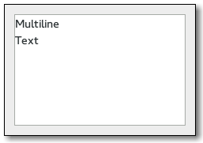

## Tutorial Multiline Text Editor
widgets | description
---|---
- | [TextIter](https://gtk-rs.org/docs/gtk/struct.TextIter.html) — Text buffer iterator
- | [TextMark](https://gtk-rs.org/docs/gtk/struct.TextMark.html) — A position in the buffer preserved across buffer modifications
- | [TextBuffer](https://gtk-rs.org/docs/gtk/struct.TextBuffer.html) — Stores attributed text for display in a GtkTextView
- | [TextTag](https://gtk-rs.org/docs/gtk/struct.TextTag.html) — A tag that can be applied to text in a GtkTextBuffer
- | [TextTagTable](https://gtk-rs.org/docs/gtk/struct.TextTagTable.html) — Collection of tags that can be used together
 | [TextView](https://gtk-rs.org/docs/gtk/struct.TextView.html) — Widget that displays a GtkTextBuffer

- Text Widget Overview — Overview of GtkTextBuffer, GtkTextView, and friends
examples: [text_viewer](text_view.rs)
