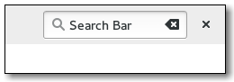

## Numeric and Text Data Entry
widgets | description
---|---
 | [Entry](https://gtk-rs.org/docs/gtk/struct.Entry.html) — A single line text entry field
- | [EntryBuffer](https://gtk-rs.org/docs/gtk/struct.EntryBuffer.html) — Text buffer for GtkEntry
- | [EntryCompletion](https://gtk-rs.org/docs/gtk/struct.EntryCompletion.html) — Completion functionality for GtkEntry
 | [Scale](https://gtk-rs.org/docs/gtk/struct.Scale.html) — A slider widget for selecting a value from a range
 | [SpinButton](https://gtk-rs.org/docs/gtk/struct.SpinButton.html) — Retrieve an integer or floating-point number from the user
 | [SearchEntry](https://gtk-rs.org/docs/gtk/struct.SearchEntry.html) — An entry which shows a search icon
 | [SearchBar](https://gtk-rs.org/docs/gtk/struct.SearchBar.html) — A toolbar to integrate a search entry with
- | [Editable](https://gtk-rs.org/docs/gtk/struct.Editable.html) — Interface for text-editing widgets

- examples: [entry_completion.rs](entry_completion.rs)
