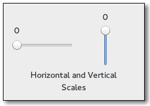
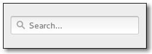

## Numeric and Text Data Entry
widgets | description
---|---
 | [Entry](https://gtk-rs.org/docs/gtk/struct.Entry.html) — A single line text entry field
- | [EntryBuffer](https://gtk-rs.org/docs/gtk/struct.EntryBuffer.html) — Text buffer for GtkEntry
- | [EntryCompletion](https://gtk-rs.org/docs/gtk/struct.EntryCompletion.html) — Completion functionality for GtkEntry
 | [Scale](https://gtk-rs.org/docs/gtk/struct.Scale.html) — A slider widget for selecting a value from a range
 | [SpinButton](https://gtk-rs.org/docs/gtk/struct.SpinButton.html) — Retrieve an integer or floating-point number from the user
 | [SearchEntry](https://gtk-rs.org/docs/gtk/struct.SearchEntry.html) — An entry which shows a search icon
 | [SearchBar](https://gtk-rs.org/docs/gtk/struct.SearchBar.html) — A toolbar to integrate a search entry with
- | [Editable](https://gtk-rs.org/docs/gtk/struct.Editable.html) — Interface for text-editing widgets

### Entry
Entry widgets allow the user to enter text. You can change the contents with the `gtk::Entry.set_text()` method, and read the current contents with the `gtk::Entry.get_text()` method. You can also limit the number of characters the Entry can take by calling `gtk::Entry.set_max_length()`.

Occasionally you might want to make an Entry widget read-only. This can be done by passing False to the `gtk::Entry.set_editable()` method.

Entry widgets can also be used to retrieve passwords from the user. It is common practice to hide the characters typed into the entry to prevent revealing the password to a third party. Calling `gtk::Entry.set_visibility()` with False will cause the text to be hidden.

[gtk::Entry](https://gtk-rs.org/docs/gtk/struct.Entry.html) has the ability to display progress or activity information behind the text. This is similar to gtk::ProgressBar widget and is commonly found in web browsers to indicate how much of a page download has been completed. To make an entry display such information, use `gtk::Entry.set_progress_fraction()`, `gtk::Entry.set_progress_pulse_step()`, or `gtk::Entry.progress_pulse()`.

Additionally, an Entry can show icons at either side of the entry. These icons can be activatable by clicking, can be set up as drag source and can have tooltips. To add an icon, use `gtk::Entry.set_icon_from_icon_name()` or one of the various other functions that set an icon from an icon name, a pixbuf, or icon theme. To set a tooltip on an icon, use `gtk::Entry.set_icon_tooltip_text()` or the corresponding function for markup.
8.1. Example
_images/entry_example.png

``` rust
import gi

gi.require_version("Gtk", "3.0")
from gi.repository import Gtk, GLib


class EntryWindow(gtk::Window):
    def __init__(self):
        gtk::Window.__init__(self, title="Entry Demo")
        self.set_size_request(200, 100)

        self.timeout_id = None

        vbox = gtk::Box(orientation=gtk::Orientation.VERTICAL, spacing=6)
        self.add(vbox)

        self.entry = gtk::Entry()
        self.entry.set_text("Hello World")
        vbox.pack_start(self.entry, True, True, 0)

        hbox = gtk::Box(spacing=6)
        vbox.pack_start(hbox, True, True, 0)

        self.check_editable = gtk::CheckButton(label="Editable")
        self.check_editable.connect("toggled", self.on_editable_toggled)
        self.check_editable.set_active(True)
        hbox.pack_start(self.check_editable, True, True, 0)

        self.check_visible = gtk::CheckButton(label="Visible")
        self.check_visible.connect("toggled", self.on_visible_toggled)
        self.check_visible.set_active(True)
        hbox.pack_start(self.check_visible, True, True, 0)

        self.pulse = gtk::CheckButton(label="Pulse")
        self.pulse.connect("toggled", self.on_pulse_toggled)
        self.pulse.set_active(False)
        hbox.pack_start(self.pulse, True, True, 0)

        self.icon = gtk::CheckButton(label="Icon")
        self.icon.connect("toggled", self.on_icon_toggled)
        self.icon.set_active(False)
        hbox.pack_start(self.icon, True, True, 0)

    def on_editable_toggled(self, button):
        value = button.get_active()
        self.entry.set_editable(value)

    def on_visible_toggled(self, button):
        value = button.get_active()
        self.entry.set_visibility(value)

    def on_pulse_toggled(self, button):
        if button.get_active():
            self.entry.set_progress_pulse_step(0.2)
            # Call self.do_pulse every 100 ms
            self.timeout_id = GLib.timeout_add(100, self.do_pulse, None)
        else:
            # Don't call self.do_pulse anymore
            GLib.source_remove(self.timeout_id)
            self.timeout_id = None
            self.entry.set_progress_pulse_step(0)

    def do_pulse(self, user_data):
        self.entry.progress_pulse()
        return True

    def on_icon_toggled(self, button):
        if button.get_active():
            icon_name = "system-search-symbolic"
        else:
            icon_name = None
        self.entry.set_icon_from_icon_name(gtk::EntryIconPosition.PRIMARY, icon_name)


win = EntryWindow()
win.connect("destroy", gtk::main_quit)
win.show_all()
gtk::main()
```
#### EntryCompletion
- examples: [entry_completion.rs](entry_completion.rs)

``` rust
//! # Entry completion example
//!
//! This example demonstrates how to build a list of items and use them
//! to autocomplete a field as the user types in something.

use gtk::prelude::*;
use gtk::{gio, glib};

use std::env::args;

struct Data {
    description: String,
}

fn create_list_model() -> gtk::ListStore {
    let col_types: [glib::Type; 1] = [glib::Type::String];

    let data: [Data; 4] = [
        Data {
            description: "France".to_string(),
        },
        Data {
            description: "Italy".to_string(),
        },
        Data {
            description: "Sweden".to_string(),
        },
        Data {
            description: "Switzerland".to_string(),
        },
    ];
    let store = gtk::ListStore::new(&col_types);
    let col_indices: [u32; 1] = [0];
    for d in data.iter() {
        let values: [&dyn ToValue; 1] = [&d.description];
        store.set(&store.append(), &col_indices, &values);
    }
    store
}

fn build_ui(application: &gtk::Application) {
    // create the main window
    let window = gtk::ApplicationWindow::new(application);
    window.set_title("Entry with autocompletion");
    window.set_border_width(5);
    window.set_position(gtk::WindowPosition::Center);
    window.set_default_size(840, 480);

    // Create a title label
    let win_title = gtk::Label::new(None);
    win_title.set_markup("<big>Which country would you like to spend a holiday in?</big>");

    // Create an EntryCompletion widget
    let completion_countries = gtk::EntryCompletion::new();
    // Use the first (and only) column available to set the autocompletion text
    completion_countries.set_text_column(0);
    // how many keystrokes to wait before attempting to autocomplete?
    completion_countries.set_minimum_key_length(1);
    // whether the completions should be presented in a popup window
    completion_countries.set_popup_completion(true);

    // Create a ListStore of items
    // These will be the source for the autocompletion
    // as the user types into the field
    // For a more evolved example of ListStore see src/bin/list_store.rs
    let ls = create_list_model();
    completion_countries.set_model(Some(&ls));

    let input_field = gtk::Entry::new();
    input_field.set_completion(Some(&completion_countries));

    let row = gtk::Box::new(gtk::Orientation::Vertical, 5);
    row.add(&win_title);
    row.pack_start(&input_field, false, false, 10);

    // window.add(&win_title);
    window.add(&row);

    // show everything
    window.show_all();
}

fn main() {
    let application = gtk::Application::new(
        Some("com.github.gtk-rs.examples.entry-completion"),
        Default::default(),
    )
    .expect("Initialization failed...");
    application.connect_activate(|app| {
        build_ui(app);
    });

    // When activated, shuts down the application
    let quit = gio::SimpleAction::new("quit", None);
    quit.connect_activate(
        glib::clone!(@weak application => move |_action, _parameter| {
            application.quit();
        }),
    );
    application.connect_startup(|application| {
        application.set_accels_for_action("app.quit", &["<Primary>Q"]);
    });
    application.add_action(&quit);

    // Run the application
    application.run(&args().collect::<Vec<_>>());
}
```

### SpinButton

A gtk::SpinButton is an ideal way to allow the user to set the value of some attribute. Rather than having to directly type a number into a gtk::Entry, gtk::SpinButton allows the user to click on one of two arrows to increment or decrement the displayed value. A value can still be typed in, with the bonus that it can be checked to ensure it is in a given range. The main properties of a gtk::SpinButton are set through gtk::Adjustment.

To change the value that gtk::SpinButton is showing, use gtk::SpinButton.set_value(). The value entered can either be an integer or float, depending on your requirements, use `gtk::SpinButton.get_value()` or `gtk::SpinButton.get_value_as_int()`, respectively.

When you allow the displaying of float values in the spin button, you may wish to adjust the number of decimal spaces displayed by calling `gtk::SpinButton.set_digits()`.

By default, gtk::SpinButton accepts textual data. If you wish to limit this to numerical values only, call `gtk::SpinButton.set_numeric()` with True as argument.

We can also adjust the update policy of gtk::SpinButton. There are two options here; by default the spin button updates the value even if the data entered is invalid. Alternatively, we can set the policy to only update when the value entered is valid by calling  `gtk::SpinButton.set_update_policy()`.

#### SpinButton Examples
``` rust
let adjustment = gtk::Adjustment::new(0.0, 0.0, 100.0, 1.0, 10.0, 0.0);
let spinbutton = gtk::SpinButton::new(Some(&adjustment), 1.0, 0);
// spinbutton.set_adjustment(&adjustment);
// self.spinbutton.connect("value-changed", self.on_value_changed)
spinbutton.connect_input(|spin_button| {
    println!("spinbutton value: {}", spin_button.get_value_as_int());
    let text = spin_button
        .get_text()
        .expect("Couldn't get text from spin_button");
    println!("spin_button_input: \"{}\"", text);
    match text.parse::<f64>() {
        Ok(value) if value >= 90. => {
            println!("circular right");
            Some(Ok(10.))
        }
        Ok(value) if value <= 10. => {
            println!("circular left");
            Some(Ok(90.))
        }
        Ok(value) => Some(Ok(value)),
        Err(_) => Some(Err(())),
    }
});
```
